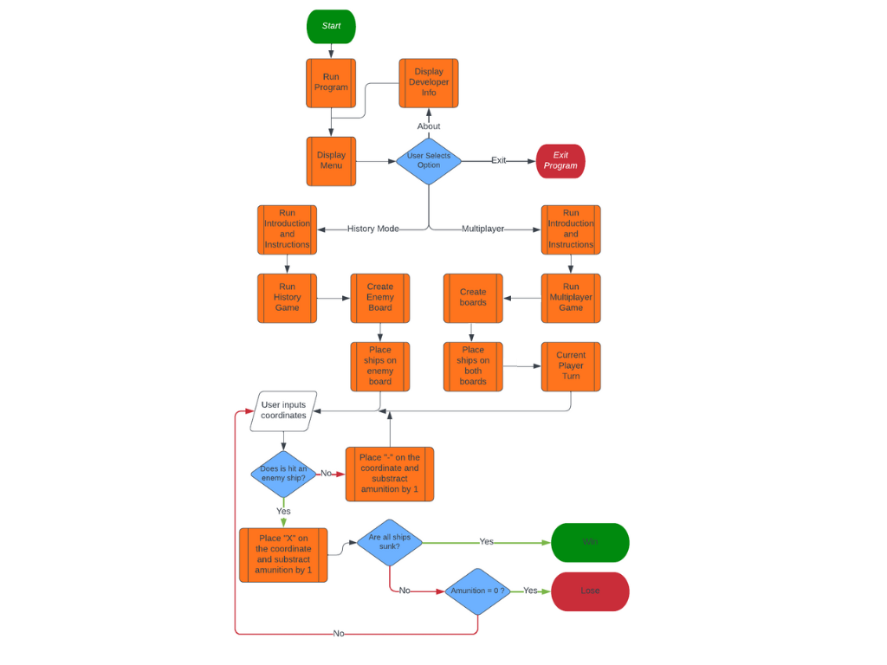

## __Battleship: Guadalcanal 1942__

Welcome to **Battleship: Guadalcanal 1942**. 

Battleship also known as Battleships or Sea Battle, is a strategy type guessing game for two players. It is played on ruled grids on which each player's fleet of warships are marked. The locations of the fleets are concealed from the other player.

On this project you will be able to play not only the multiplayer version (2 players) but also a History Mode (Player vs Computer) based on historical data with personalised dialogue.

[Live link to website](https://battleship-guadalcanal-1942.herokuapp.com/)

## __Tech Stack__

 **VS Code**
 **Gitpod**
 **Python**
 **Git**
## UX & Design

### User Stories

- As a player, I want to be able to see my opponent's board during the game so that I can make educated guesses about where their ships are located.

- As a player, I want to be able to make my moves by selecting the Row and Column on the game board so that I can play the game intuitively.

- As a player, I want to be notified when one of my ships is hit so that I can keep track of the game's progress.

- As a player, I want to be able to see which of my opponent's ships have been hit and which ones are still a mystery so that I can adjust my strategy accordingly.

- As a player, I want to be able to play against the computer or another player so that I can enjoy the game in different ways.

- As a player, I want to be able to see the results of the game, including which ships were sunk and which player won, so that I can review the game and improve my strategy for future games.

- As a player, I want to be able to play with different types of ships with varying sizes so that I can have a unique gameplay experience.

- As a player, I want to be able to play the game in different modes, such as a limited number of moves, so that I can add more challenge and variety to the gameplay.
### Flowchart

A flowchart is a graphical representation of a process or system that shows the steps or stages involved and the relationships between them. I created a flowchart to provide a visual representation of the steps that a user need to follow in order to achieve a particular goal, such as navigating through the application.

## Credits

### Concept

- Concept for History Mode is based on historical data better explained [here.](https://www.youtube.com/watch?v=G_QhTdzWBJk)

### Code

- Starting idea for functionality and design from [Parzibyte.](https://github.com/parzibyte) [here.](https://www.youtube.com/watch?v=43Vt9O_t4uY)
- Reviewed material for History Mode development [Michael Carberry.](https://github.com/cmikedev) [Here.](https://github.com/cmikedev/battleship)

### Design

- Tech Stack Icons [github.com/Marwin1991](https://github.com/marwin1991/profile-technology-icons)

## Acknowledgement

**[Harry Dhillon](https://github.com/Harry-Leepz)** for being my mentor on this project and provide excellent feedback from real work experience.