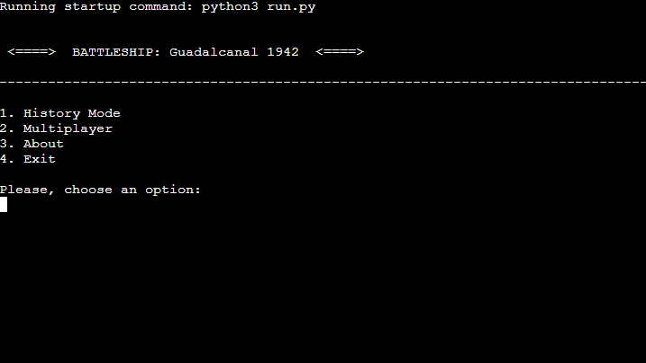
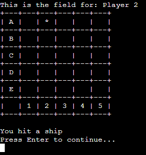

## __Battleship: Guadalcanal 1942__

Welcome to **Battleship: Guadalcanal 1942**. 

Battleship also known as Battleships or Sea Battle, is a strategy type guessing game for two players. It is played on ruled grids on which each player's fleet of warships are marked. The locations of the fleets are concealed from the other player.

On this project you will be able to play not only the multiplayer version (2 players) but also a History Mode (Player vs Computer) based on historical data with personalised dialogue.

[Live link to website](https://battleship-guadalcanal-1942.herokuapp.com/)

## __Tech Stack__

 **VS Code**
 **Gitpod**
 **Python**
 **Git**
## UX & Design

### User Stories

- As a player, I want to be able to see my opponent's board during the game so that I can make educated guesses about where their ships are located.

- As a player, I want to be able to make my moves by selecting the Row and Column on the game board so that I can play the game intuitively.

- As a player, I want to be notified when one of my ships is hit so that I can keep track of the game's progress.

- As a player, I want to be able to see which of my opponent's ships have been hit and which ones are still a mystery so that I can adjust my strategy accordingly.

- As a player, I want to be able to play against the computer or another player so that I can enjoy the game in different ways.

- As a player, I want to be able to see the results of the game, including which ships were sunk and which player won, so that I can review the game and improve my strategy for future games.

- As a player, I want to be able to play with different types of ships with varying sizes so that I can have a unique gameplay experience.

- As a player, I want to be able to play the game in different modes, such as a limited number of moves, so that I can add more challenge and variety to the gameplay.
### Flowchart

A flowchart is a graphical representation of a process or system that shows the steps or stages involved and the relationships between them. I created a flowchart to provide a visual representation of the steps that a user need to follow in order to achieve a particular goal, such as navigating through the application.

### Modules

- The [os](https://docs.python.org/3/library/os.html) module was used to create the clear_screen function to enhance user experience and reduce clutter on screen.

- The [random](https://docs.python.org/3/library/random.html) module was used place the ships randomly across the board game.

- The [time](https://docs.python.org/3/library/time.html) module was used for sleep() to create timers to get a smooth transition.

- The [sys](https://docs.python.org/3/library/sys.html) module was used to create a typing effect when presenting the information on the console.

### Features

- Introduction screen

    - When the app loads the user is presented with a menu that allows a better and easy navigation

    - The menu options are 2 play modes, information about the person who develop the app and exit option from the app

 

- Introduction History Mode

    - When the user selects the "History Mode" is presented with an introduction to the game in this mode. The text is presented with a typing effect to simulate a message is being receive in the console.
    - In the introduction it makes clear the details of the computer ships

- Instructions History Mode

    - The instructions are provided to the user to understand the rules of the game

- Board Preparation

    - Before the game start a message is displayed to the user following the history behind an historical fact followed by a description of the enemy fleet in this game mode against the computer

- Board Game 

    - An initial board game is created with enemy ships hidden
    - User can visualize the grid, amount of shells (turns) left.
    - User is invited to guess coordinates 

- Target Miss 

    - When the user miss a shot a dash "-" populate the grid to indicate a failed shot

- Target Hit
    
    - When the user hit a ship an asterisk  "*" populate the grid to indicate a successful shot

- Input Validation

    - When the user does not follow the instructions on how to select a ROW and a COLUMN to make a shot, a message is displayed to warn the user to select valid a valid option.

- History Mode defeat

    - If the user lose the game a message is displayed together with all ships that were hidden during the game.

- Multiplayer Instructions

    - As in History mode, here is displayed the instructions to the players

- Multiplayer Board Preparation

    - In this section a message is displayed showing with details the ships places on each other player's board.

- Multiplayer First Turn

    - In this section a message display the current player turn, remaining amunition and the grid from the opponent.

- Multiplayer Hit

    - If a player hit a ship an asterisk "*" populate the coordate where it was shot.
    - A message is displayed to continue shooting.

.

- Multiplayer Miss

    - If a player miss the shot a dash "-" populate the coordate where it was shot.

- Multiplayer Second Turn

    - When the second player start to play a message display the change of turn, with its respective remaining amunition and enemy board.

## Code Validation

- One of the valitadors used was CI Python Linter

## Deployment

Code Institute has provided a [template](https://github.com/Code-Institute-Org/python-essentials-template) to display the terminal view of this backend application in a modern web browser. This is to improve the accessibility of the project to others.

The live deployed application can be found at [Battleship: Guadalcanal 1942](https://battleship-guadalcanal-1942.herokuapp.com/).

### Local Deployment

*Gitpod* IDE was used to write the code for this project.

To make a local copy of this repository, you can clone the project by typing the follow into your IDE terminal:
- `git clone https://github.com/giankpetrov/python-battleship.git`

Alternatively, if using Gitpod, you can click below to create your own workspace using this repository.

### Heroku Deployment

This project uses [Heroku](https://www.heroku.com), a platform as a service (PaaS) that enables developers to build, run, and operate applications entirely in the cloud.

Deployment steps are as follows, after account setup:

- Select *New* in the top-right corner of your Heroku Dashboard, and select *Create new app* from the dropdown menu.
- Your app name must be unique, and then choose a region closest to you (EU or USA), and finally, select *Create App*.
- From the new app *Settings*, click *Reveal Config Vars*, and set the value of KEY to `PORT`, and the value to `8000` then select *add*.
- Further down, to support dependencies, select *Add Buildpack*.
- The order of the buildpacks is important, select `Python` first, then `Node.js` second. (if they are not in this order, you can drag them to rearrange them)
For Heroku deployment, follow these steps to connect your GitHub repository to the newly created app:

- In the Terminal/CLI, connect to Heroku using this command: `heroku login -i`
- Set the remote for Heroku: `heroku git:remote -a <app_name>` (replace app_name with your app, without the angle-brackets)
- After performing the standard Git `add`, `commit`, and `push` to GitHub, you can now type: `git push heroku main`

The frontend terminal should now be connected and deployed to Heroku.

## Credits

### Concept

- Concept for History Mode is based on historical data better explained [here.](https://www.youtube.com/watch?v=G_QhTdzWBJk)

### Code

- Starting idea for functionality and design from [Parzibyte.](https://github.com/parzibyte) [here.](https://www.youtube.com/watch?v=43Vt9O_t4uY)
- Reviewed material for History Mode development [Michael Carberry.](https://github.com/cmikedev) [Here.](https://github.com/cmikedev/battleship)

### Design

- Tech Stack Icons [github.com/Marwin1991](https://github.com/marwin1991/profile-technology-icons)
- Ideas to finish my README file from [adamgilroy22](https://github.com/adamgilroy22) and [cmikedev](https://github.com/cmikedev)
## Acknowledgement

**[Harry Dhillon](https://github.com/Harry-Leepz)** for being my mentor on this project and provide excellent feedback from real work experience.

Namaste ☸